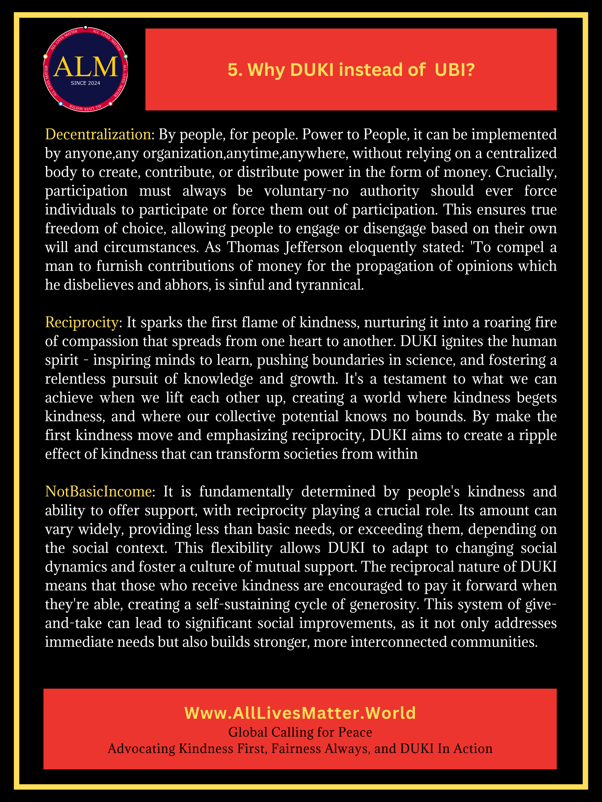

# [All Lives Matter Worldwide](https://www.alllivesmatter.world) 

## Global Call for Peace and Humanity

* **Kindness First**  A single act of kindness throws out roots in all directions, and the roots spring up and make new trees.
* **Fairness Always** You shall judge the people with righteous judgment. You shall not pervert justice. You shall not show partiality, and you shall not accept a bribe, for a bribe blinds the eyes of the wise and subverts the cause of the righteous
* **DUKI In Action** He causes his sun to rise on the evil and the good, and sends rain on the righteous and the unrighteous.

DUKI (pronounced 'djuːki', reminiscent of 'duty','kindness' and 'cookie') stands for Decentralized Universal Kindness Income. It refers to money distributed to everyone as an act of kindness, generated through the hard works of kind people around the world. DUKI aim to empower people to gain freedom, reject evil, do good, and spread kindness.

Dukiness:/ˈdjuːkiːnəs/: Spirit behind "All Lives Matter Worldwide," which is not just a truth to uphold but also a unifying superpower that all lives can hold. Dukiness embodies the mindset and actions aligned with principles of universal kindness, fairness, and decentralized empowerment. It inspires individuals to pursue freedom, reject negativity, cultivate goodness, and spread kindness, ultimately striving to elevate the value and dignity of all lives globally.

### What is DUKI?

### Why DUKI instead of UBI 

[Learn more about AllLivesMatter.World here](https://www.alllivesmatter.world).

### License
'DUKI LICENSE', which is essentially the same as the MIT license, except there is a clause 'Share your Success: 2.5% profit to DUKI when earned.' 

The DUKI license requires companies using open-source projects to contribute n% (where n is typically 1-5, default to 2.5) of their total business profit towards fostering universal kindness. This model addresses the imbalance where large corporations, for example cloud providers, benefit significantly from open-source without proportionate contribution. It exempts project creators and maintainers and aims for broader societal impact rather than direct developer compensation. While potentially discouraging adoption due to financial implications, DUKI represents a shift towards using open-source as a catalyst for corporate social responsibility and global well-being.

While technology itself is inherently neutral, the DUKI license incorporates an ethical attitude towards its usage. It expresses a strong wish for the software to be used for good. By tying usage to universal kindness, DUKI encourages companies to consider the broader impact of their technological implementations. 

AllLivesMatter&middot;World is [DUKI licensed](./LICENSE).

## Contributing
Contributions to improve internationalization (i18n) and support for right-to-left (RTL) language locales are welcome.
#### To Add a New Language 
* Copy the i18n/en.json file and rename it to your target language (e.g., i18n/fr.json for French)
* Translate the values in the new file, keeping the keys unchanged
* change the constants/index.ts LANGUAGES array to include the new language
* Test the application with the new language to verify correct rendering and functionality

#### Right-to-Left (RTL) Language Support
Currently, there are no specific implementations for RTL support. Contributions are welcome. 

### Contributing Guide

The primary focus of this repository is public advocacy, rather than technical development. The original efforts are largely dedicated to cultivating ideas, refining thoughts, and carefully selecting words to express them. While there might be occasional errors or misused terms, the real value lies in the ideas themselves.
Apart from Right-To-Left (RTL) language support, the most significant contributions often come from thoughtful word choice. In this spirit, selecting the most fitting terms in the native language to accurately convey the intended messages is encouraged.
